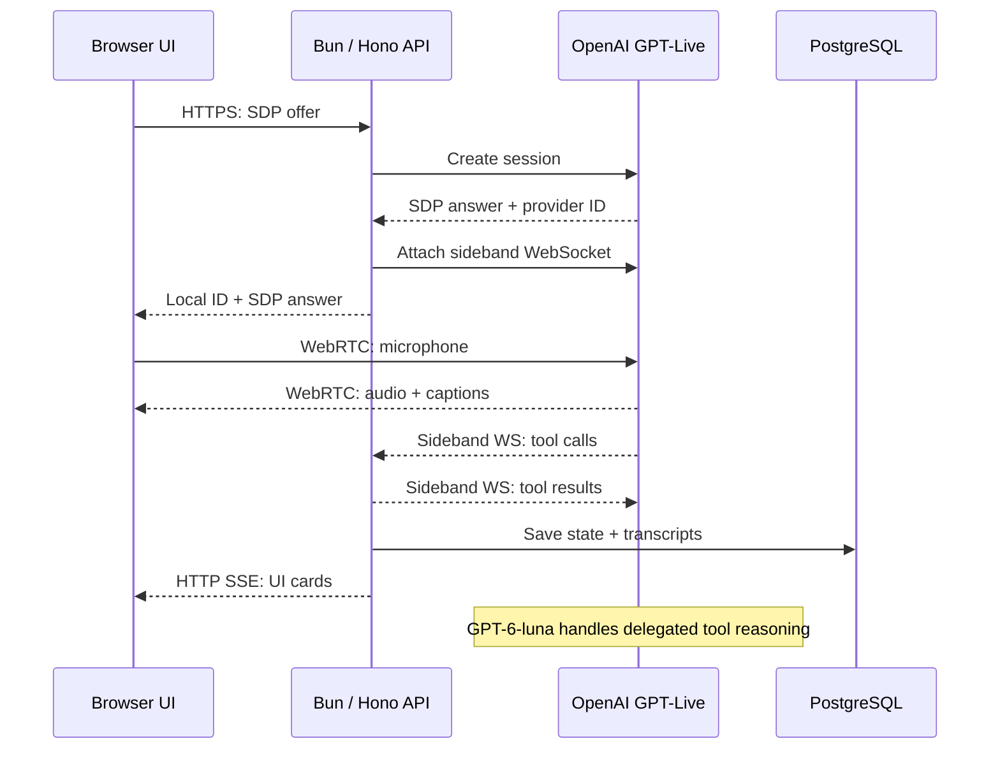
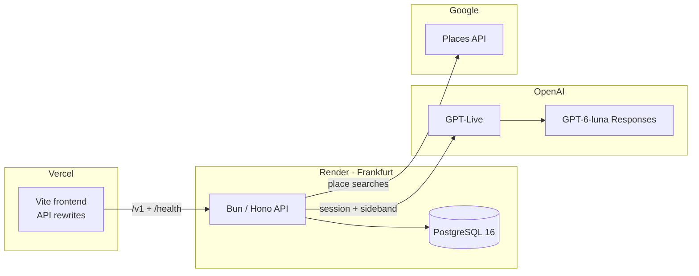

# My personal voice assistant

My voice agent is a single-user voice assistant with persistent memory, nearby places, and a hotel reservation workflow. It uses React/Vite, a Bun/Hono API, PostgreSQL, GPT-Live, and a delegated Responses model.

## Architecture



The API negotiates the session and keeps the OpenAI key, prompts, and tools private. The browser then sends and receives audio directly over WebRTC, avoiding an extra API hop and its latency. GPT-Live handles full-duplex speech and interruptions for a more natural conversation. The server's sideband WebSocket handles trusted tool work and transcript persistence; authenticated HTTP SSE pushes generated UI events to the browser. See [architecture details](docs/architecture.md).

**Memory:** The delegated model searches PostgreSQL before saving durable facts and preferences. It can recall or correct a memory by ID. Exact duplicates are blocked by a database fingerprint; retrieval currently uses bounded keyword, entity, and time filters. Transcript snapshots are also stored in PostgreSQL.

**Workflow:** The model can request hotel options and fill reservation fields in any order. The reservation service validates each change, calculates the quote, derives the next missing field from saved state, and publishes progress/options over SSE. Revision checks prevent stale writes. Confirmation requires an explicit voice request or browser click and rechecks the quote. This hotel workflow is code-defined today.

## Install and operate

Use Docker Compose (or Bun 1.3.11 for local processes). Copy `.env.example` to `.env`; set `APP_PASSWORD` (12+ characters), `JWT_SIGNING_SECRET` (32+ characters), `OPENAI_API_KEY`, and `GOOGLE_MAPS_API_KEY`.

```sh
cp .env.example .env
docker compose --env-file .env -f infra/local/docker-compose.yaml up --build
```

Compose starts PostgreSQL, runs migrations and the hotel seed, then starts the API and UI. Open [localhost:5173](http://localhost:5173); the API is at [localhost:3000](http://localhost:3000), with Swagger at [localhost:3000/docs](http://localhost:3000/docs). Use `docker compose --env-file .env -f infra/local/docker-compose.yaml down` to stop; the database volume remains. Health checks are `/health/live` and `/health/ready`.

For local processes instead of Compose, start PostgreSQL, set `DATABASE_URL` in `.env`, then run `bun install --frozen-lockfile --linker hoisted`, `set -a; . ./.env; set +a`, and `bun run migrate`. Run `bun run --cwd apps/api dev` and `bun run --cwd apps/web dev` in separate terminals with the environment loaded. Use `bun run lint`, `bun run typecheck`, `bun run test`, and `bun run build` to check changes. Database integration tests need an isolated `RESERVATION_TEST_DATABASE_URL` or `TEST_DATABASE_URL` as appropriate.

## Deployment



| Node | Deployment details |
| --- | --- |
| Vercel frontend | Static Vite build. `RENDER_API_ORIGIN` routes API and health requests to Render; no frontend server to keep warm. |
| Render API | Docker, Free plan, Frankfurt, 0.1 CPU / 512 MB. Runs migrations before listening; health check at `/health/ready`. Sleeps after 15 minutes without inbound traffic; waking takes about a minute. Free instances can restart, interrupting live SSE or sideband connections. |
| Render PostgreSQL | Free PostgreSQL 16 in Frankfurt, 1 GB storage; expires 30 days after creation unless upgraded. |
| OpenAI | Managed GPT-Live session with `gpt-6-luna` Responses delegation. Browser audio uses direct WebRTC; API tools use the sideband WebSocket. |
| Google Places | Managed Places API, called only by the API with a server-held key. |

Set Render's `ALLOWED_ORIGIN` to the Vercel HTTPS origin. See [deployment steps](docs/deployment.md) and Render's [Free plan limits](https://render.com/docs/free).

## If this became a production app

- Add tenant-scoped data and sessions; the current app has one shared user history.
- Replace the shared password and stateless JWT setup with an identity provider.
- Separate session creation, WebRTC setup, and WebRTC event handling more cleanly.
- Improve memory retrieval with semantic search and a small agentic query operator.
- Extract memories in a background agent from transcript snapshot diffs instead of relying on live model decisions.
- Make workflows generic with reusable steps and dynamic JSON schemas, without code changes per workflow.
- Add MCP support for external tools and data sources.
- Model real provider costs per session, user, and workspace; enforce user and workspace quotas.
- Cache inexpensive shared reads such as user status when scale warrants it.
- Support session branching and UI checkpoints.
- Add dark mode and improve the agent avatar's UI and interaction design.
- Use more reliable infrastructure with warm capacity and enough graceful shutdown time for SSE and sideband connections.
- Add end-to-end telemetry and tracing for connection failures, edge cases, and latency.
- Expand end-to-end tests with Testcontainers instead of relying mainly on mocked services.
