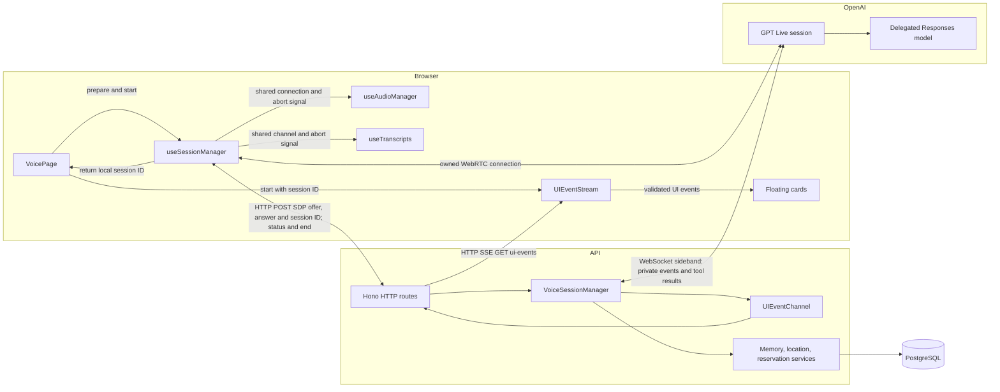

# Sarjy architecture

## Runtime

The Bun workspace contains a React/Vite frontend, a Hono API, shared contracts and authentication, PostgreSQL through Drizzle, and a one-shot migration app. Authentication uses a shared password and stateless access/refresh JWTs. Memory is shared across this installation.

The browser sends an authenticated JSON SDP offer to `POST /v1/voice/sessions`. The API creates a local `voice_sessions` record, calls `client.live.create`, saves the provider session ID, and opens an authenticated sideband at `wss://api.openai.com/v1/live/sessions/{session_id}/attach`. It registers listeners immediately and waits for socket open before returning `{id, sdp}`. An attached session is already started; the API never sends `session.start`.

Microphone and assistant audio travel directly between the browser and OpenAI through WebRTC. The browser’s data channel receives only captions, usage, lifecycle events, and errors. It cannot submit model changes or tool results, and cannot receive private Responses events. The API key, prompts, backend configuration and tool execution remain on the API server. `useSessionManager` owns SDP negotiation and the WebRTC connection. `useAudioManager` attaches microphone and playback handling, while `useTranscripts` listens to the shared data channel. Both detach when the session signal aborts. `VoicePage` passes the local session ID to `UIEventStream`, which receives validated floating-card updates through authenticated HTTP SSE. The UI stream can fail without ending WebRTC audio. The browser separately polls the authenticated session-status endpoint to expose sideband and memory errors.

The voice model is `gpt-live-1`; the Responses backend is `gpt-6-luna`. These are server-owned constants. The Live prompt controls conversational style, interruptions, and when to delegate. The backend prompt controls memory use and truthful tool-result reporting. See the official [WebRTC](https://developers.openai.com/api/docs/guides/voice-webrtc), [server controls](https://developers.openai.com/api/docs/guides/voice-server-controls), and [delegation](https://developers.openai.com/api/docs/guides/live-delegation) documentation.

## Persistence

`voice_sessions` tracks our UUID, provider session ID, model, lifecycle status, timestamps, finalization, errors and usage. Existing historical rows retain their original model; new rows default to GPT-Live.

`transcript_snapshots` contains UUID, local session foreign key, speaker, text, start/end milliseconds and creation time. Sideband input/output deltas are buffered without trimming or inserting spaces. Serialized flushes append snapshots every second and at close. Stable chunk IDs make ambiguous database retries idempotent. The browser displays data-channel captions; only the sideband persists text. The read endpoint returns at most 5,000 snapshots in session-time order. These snapshots are chunks, not complete utterances. No raw audio is stored.

`memories` contains UUID, original source-session foreign key, content, optional plain entity label, optional event time, a normalized uniqueness fingerprint, and creation/update timestamps. Event time describes when a fact or event occurred, separately from when it was recorded. Corrections update the row in place and preserve its original source session. No additional infrastructure is required for memory extraction or lookup.

## Memory tools

The Responses backend registers `search_memory`, `remember_fact`, and `correct_memory`. Arguments are validated by strict schemas; text, result count and keyword count are bounded. Queries use parameterized literal keyword matches plus optional exact entity and event-time bounds. The model searches before writing to avoid semantic duplicates; the database fingerprint also prevents identical concurrent inserts. Corrections replace existing facts by ID. Unknown tools, invalid input and lookup/write failures produce explicit error results and never fabricated success.

Personal recall delegates to the backend before answering. Memory queries use short literal keywords; empty or irrelevant results are broadened, ending with a bounded recent-fact lookup. An unsuccessful lookup does not prove a fact was never saved. The prompts keep conversation/delegation guidance separate from backend workflow rules. Run `bun --env-file .env apps/api/src/voice/memory-prompt.eval.ts` for opt-in model checks using synthetic facts only; this does not read or write application memory. The regular tests do not call OpenAI.

The sideband dispatches `response.event` envelopes and reads completed function calls from nested `response.output_item.done`. Results are sent as `response.item.create` / `function_call_output` with the original call ID. After all required outputs are sent and the response stream completes, `response.create` continues the backend. Completed outcomes remain cached per call ID for the session, so redelivery cannot repeat a write. Interrupting assistant speech does not cancel application memory commits.

## Lifecycle

The session manager is constructed once in `main.ts` and is a required dependency of Hono and shutdown handling. It receives separate `VoiceSessionService`, `MemoryService`, and `TranscriptService` interfaces, each backed by its own Drizzle implementation. Session lifecycle records, durable facts, and transcript persistence stay within their respective services. `VoiceChatProvider` is implemented by the `GPTLiveVoiceChatProvider` class; its sideband adapter is also a class. Runtime construction failures close initialized resources and fail startup before the HTTP server listens. Sideband events are dispatched through switches into documented handlers, including nested Responses events. Active sockets, transcript buffers, pending tools and final-event waiters are owned by local session ID. Setup failure attempts provider hangup and records failure. Sideband loss is exposed through session status, flushes buffered transcripts, and triggers bounded cleanup. There is no reconnect loop.

Stop aborts the shared browser session signal: audio and transcript listeners detach, microphone tracks stop, and the session manager closes the data channel and peer connection once. The authenticated end endpoint is idempotent. The server drains existing tool results and Responses continuations, sends `session.close` with its final-event listener already registered, and waits for `session.closed` or the deadline. It saves final usage/reason, flushes transcripts and releases the sideband. Missing final events are recorded as incomplete; provider hangup is attempted before resources are released. Browser resources are already released while server finalization runs. See [graceful close](https://developers.openai.com/api/docs/guides/live-conversations).

SIGTERM/SIGINT mark the process draining, reject new sessions, abort session creation and drain active sessions concurrently before closing PostgreSQL. Late creation completions are cleaned up. The overall shutdown budget is 12 seconds, leaving margin inside the deployment’s 15-second allowance. One API process owns its sidebands; horizontal session ownership requires a separate design.

## HTTP and deployment

Every voice route requires a verified access JWT and enforces the allowed browser origin. Login, refresh, logout, health, and generated OpenAPI remain as implemented in phase 1. Shared contracts define voice offers, answers, status and transcript responses. Errors contain a code, message and request ID. Avoid logging passwords, JWTs, SDP, raw audio, or full tool arguments.

Compose forwards `OPENAI_API_KEY` only to the API. Public frontend configuration contains an optional API origin. Render can host the API and PostgreSQL while Vercel hosts the static frontend; production deployment is covered by plan 03.

Audio recordings, user accounts, tenant isolation, vector search, memory-management screens, and horizontal sideband ownership remain outside this phase.
