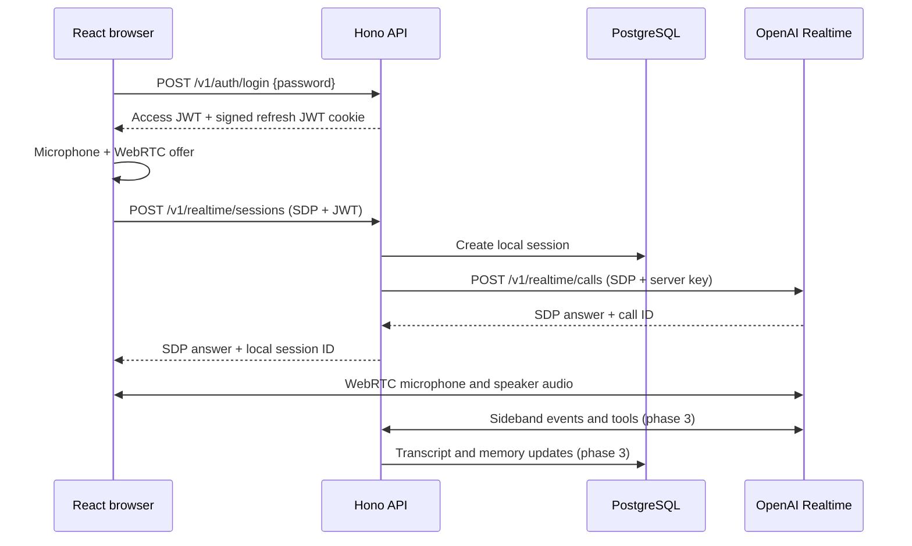

# Voice agent architecture

Status: proposed implementation design, 2026-09-23. The OpenAI details below were checked against the [WebRTC guide](https://developers.openai.com/api/docs/guides/voice-webrtc), [server-side controls guide](https://developers.openai.com/api/docs/guides/voice-server-controls), and [Realtime tools guide](https://developers.openai.com/api/docs/guides/realtime-mcp). Confirm model names and API shapes again when implementing because these APIs evolve.

## Scope and decisions

- React + Vite frontend; Hono on Node.js backend. Keep database, cache, and auth concerns in sibling backend-only packages under `packages/`: `database` contains the PostgreSQL/Drizzle adapter and migrations, `cache` contains the Redis adapter, and `auth` contains password and stateless JWT logic. The API app composes them without an `infrastructure` directory. Keep app-local UI in `apps/web/src/components`, hooks in `hooks`, global theme config in `themes`, and route screens in `pages` with React Router route definitions in `app`. Use Bun for workspace management, installation, and scripts with Turborepo for task orchestration. Run a Redis-compatible service in the phase 1 local Docker Compose mesh at `infra/local/docker-compose.yaml`, then use it for application behavior only when a measured need appears. Reserve `infra/render` for the phase 4 Render Blueprint.
- One server environment password grants access to one shared installation. No Firebase, user table, per-user isolation, or concurrent-session cap.
- Password is sent in the body of `POST /v1/auth/login` over HTTPS. Do not put it in a URL: browser history, analytics, proxies, and server logs may retain URLs. If a password-in-URL entry page is essential later, exchange a short-lived one-time code rather than the password.
- Short-lived access JWT for API authorization. A longer-lived signed refresh JWT lives in an HttpOnly, Secure cookie. Both are validated statelessly with distinct token types, issuer, audience, signature, and expiry; no refresh-token table is needed. The frontend refreshes before access expiry. Logout clears browser credentials, but a copied refresh JWT remains usable until expiry or signing-key rotation. Keep refresh lifetime bounded and document this limit. A refresh token is an application auth credential, separate from any OpenAI Realtime credential.
- Each app owns an `env.ts` built with `@t3-oss/env-core` and Zod. The API validates server settings from `process.env`; the web app validates only public `VITE_` settings from `import.meta.env`. Shared packages take typed settings through constructors or factories and never read environment variables directly. [T3 Env core](https://env.t3.gg/docs/core)
- Browser audio uses WebRTC directly with OpenAI. Hono authenticates and creates every Realtime call using the unified `/v1/realtime/calls` interface, then returns the SDP answer. The OpenAI API key stays server-side. This follows OpenAI's current browser recommendation and avoids relaying audio through Hono. [Source](https://developers.openai.com/api/docs/guides/voice-webrtc)
- Phase 2 has voice only and `tool_choice: none`. Phase 3 adds server-owned Realtime function tools through a sideband WebSocket attached with the call ID returned in the `Location` header. The server handles tool calls and sends tool results back to OpenAI. [Source](https://developers.openai.com/api/docs/guides/voice-server-controls)
- Memory is inspired by Mem0's extract, consolidate, store, retrieve cycle, but retrieval is limited to keyword, time, and entity filters. No embeddings, vector database, or similarity search in this version. [Mem0 overview](https://mem0.ai/blog/long-term-memory-ai-agents)

## Request and audio paths

Hono owns session configuration, model selection, prompts, tool definitions, and authorization. The browser owns microphone permission, WebRTC lifecycle, playback, mute, interruption UI, and connection status. In phase 3, the browser may display tool status events, but it never executes privileged memory tools. OpenAI's sideband connection supports server monitoring, instruction updates, and tool responses. [Source](https://developers.openai.com/api/docs/guides/voice-server-controls)

The initial deployment should use one API instance for the in-memory mapping between a live call and its sideband socket. Store durable session records in PostgreSQL. When horizontal scaling is needed, add a clear owner/coordination mechanism; do not imply that Redis already solves sideband affinity. Deploys or host restarts can interrupt a live sideband connection, so the UI must offer reconnect and the server must mark interrupted calls appropriately.

## Memory behavior

“Semantic memory” means durable atomic facts, not semantic/vector retrieval. Each fact has a source, entity links, timestamps, and a lifecycle state. A single shared password means all facts belong to the same installation scope; the app must say this plainly in the UI before memory is enabled.

1. Collect completed text turns from Realtime events. Keep raw audio out of PostgreSQL by default. Identify each turn by `(session_id, provider_item_id)` for idempotency.
2. After a turn or session, extract candidate durable facts in a background job. Include relative-time normalization using the turn's actual timestamp. Do not promote every sentence or speculative assistant text.
3. Compare a candidate against active facts with the same entity/fact key. Choose add, update/supersede, retract, or no-op. Preserve revision history and the original source. Prefer an explicit correction over an older inferred fact.
4. Retrieve with PostgreSQL full-text search plus optional entity and time predicates. Bound results and prompt size. Use deterministic ranking: exact entity/fact-key match, text rank, then recency and provenance. PostgreSQL recommends GIN indexes for full-text search. [Source](https://www.postgresql.org/docs/current/textsearch-indexes.html)
5. At session creation, inject only a small stable profile and relevant memories. For questions needing more detail, the model calls `search_memory` through the sideband. `remember_fact` is available for explicit “remember this” requests; normal extraction happens asynchronously after turns. Treat deletion or correction as a first-class operation.

Redis can later cache short-lived search results or coordinate background jobs. PostgreSQL remains the source of truth. Start with a PostgreSQL-backed job/outbox table so work survives process restarts; use Redis for application work if measurements justify it. The local Compose mesh includes Redis from phase 1, while production provisioning waits until the app uses it.

## Data model and indexes

All IDs are UUIDs. Use `timestamptz` in UTC and ISO 8601 at the API boundary. `packages/database` owns the Drizzle migrations; the table below is a logical schema, not final migration code. Authentication has no database table.

| Table | Core columns | Phase and purpose |
| --- | --- | --- |
| `voice_sessions` | `id`, `vendor` (default `openai`), `vendor_session_id` nullable, `status`, `model` (required; default `gpt-realtime-2.1`), `started_at`, `ended_at`, `end_reason` | 1 base; 2 records live calls and failure/close state. |
| `transcript_items` | `id`, `session_id`, `provider_item_id`, `role`, `text`, `occurred_at`, `created_at` | 3: source text; unique `(session_id, provider_item_id)`. |
| `entities` | `id`, `scope_key`, `kind`, `canonical_name`, `normalized_name`, `created_at` | 3: named people, projects, places, organizations, etc.; unique `(scope_key, kind, normalized_name)`. |
| `memories` | `id`, `scope_key`, `fact_key`, `content`, `status`, `confidence`, `event_at`, `valid_from`, `valid_to`, `source_session_id`, `source_item_id`, `superseded_by_id`, `created_at`, `updated_at` | 3: atomic facts with explicit temporal meaning. `scope_key` is `default` until multi-principal auth exists. |
| `memory_entity_links` | `memory_id`, `entity_id` | 3: many-to-many entity filtering. Composite primary key. |
| `memory_revisions` | `id`, `memory_id`, `action`, `before`, `after`, `reason`, `created_at` | 3: audit trail for add/update/retract. |
| `memory_jobs` | `id`, `source_item_id` unique, `status`, `attempts`, `available_at`, `locked_at`, `error`, `created_at` | 3: durable extraction queue with retry and idempotency. |

Indexes: unique `(vendor, vendor_session_id)` when a provider ID exists; `(status, started_at)` on sessions; `(scope_key, status, event_at DESC)` on memories; `(scope_key, fact_key, status)` for consolidation; GIN on a generated full-text `tsvector` for `content`; `(entity_id, memory_id)` and `(memory_id, entity_id)` on links; `(status, available_at)` on jobs. Choose a text search configuration matching actual supported languages; `simple` is a sensible starting point for mixed language content. Add `pg_trgm` only if observed keyword typo/fuzzy needs warrant it. [PostgreSQL text search](https://www.postgresql.org/docs/current/textsearch-controls.html), [pg_trgm](https://www.postgresql.org/docs/current/pgtrgm.html)

`valid_from`/`valid_to` describe when a fact held; `event_at` describes when an event happened; `created_at` describes when it was recorded. Keep them separate so “what was true in March?” and “what happened in March?” have distinct meanings. Memory history should be append-oriented: a replacement marks an older fact superseded and links to the new one.

## HTTP API

All `/v1/*` routes except login and refresh require `Authorization: Bearer <access JWT>`. Validate the JWT issuer, audience, signature, expiry, and token type. Validate bodies and generate OpenAPI from the same schemas. Return structured errors `{error: {code, message, requestId}}`. Never log passwords, refresh tokens, access JWTs, SDP, raw audio, or full tool arguments.

| Method/path | Request | Response and notes |
| --- | --- | --- |
| `POST /v1/auth/login` | JSON `{password}` | `{accessToken, expiresAt}` plus signed refresh JWT cookie; generic invalid-credential response. |
| `POST /v1/auth/refresh` | Refresh cookie | Validate refresh JWT and return a new access JWT without extending the refresh JWT's original expiry. Existing refresh JWTs remain valid until expiry or signing-key rotation. |
| `POST /v1/auth/logout` | Refresh cookie | `204`; clear the cookie and client access token. Stateless logout cannot revoke a copied JWT. |
| `GET /health/live` | None | `200` when process is running; no downstream dependency checks. |
| `GET /health/ready` | None | `200` only when required dependencies such as PostgreSQL are reachable. Keep it cheap. |
| `GET /openapi.json`, `GET /docs` | None, or protect docs in production | Machine-readable OpenAPI and Swagger UI. |
| `POST /v1/realtime/sessions` | `application/sdp` body + access JWT | `application/sdp` answer, `X-Session-Id` header; server captures OpenAI call ID. Phase 2. |
| `POST /v1/realtime/sessions/{id}/end` | Empty body | `204`; idempotent local close/cleanup. Phase 2. |
| `GET /v1/memories` | `q`, `entity`, `from`, `to`, `timeType=event\|valid`, `limit`, `cursor` | Bounded results with source/time/status. Phase 3. |
| `POST /v1/memories` | Atomic fact + optional entity/time | Explicit manual add. Phase 3. |
| `PATCH /v1/memories/{id}` | Correction fields | New revision and supersession. Phase 3. |
| `DELETE /v1/memories/{id}` | None | Soft retract with revision. Phase 3. |

Internal sideband functions: `search_memory({query?, entity?, from?, to?, timeType?, limit?})`, `remember_fact({content, entities?, event_at?})`, and `correct_memory({memory_id, replacement?})`. Validate arguments on the server and cap both query width and output size. The Realtime API supports application-owned function tools and remote MCP tools; function tools are the better fit for private memory and business rules. MCP can be added later through a narrow server-owned adapter or a vetted remote MCP server, with an allowlist and approval policy for writes. Remote MCP execution happens at OpenAI, so it has different trust and latency properties. [Source](https://developers.openai.com/api/docs/guides/realtime-mcp)

## Latency design and measurement

- Use WebRTC media tracks and a native audio element for playback. Do not shuttle audio chunks through Hono or JavaScript on the normal path. [OpenAI WebRTC guidance](https://developers.openai.com/api/docs/guides/voice-webrtc)
- Create the microphone track and peer connection while the browser prepares the authorized session request; keep the start button state explicit. On a new visit, refresh authentication before the user presses Start when possible.
- Keep the initial session prompt concise. Phase 3 memory prefetch should have a strict time budget and small top-K; let the agent start without old facts if memory lookup times out, then use a tool when needed. Do not block every speech turn on extraction or memory writes.
- Use voice activity detection and interruption/barge-in handling. Tune turn-end delay using real speech samples rather than guessing one global value; premature cuts and long silence both hurt perceived latency.
- Keep the sideband connection open for the live call, attach it as soon as the call ID is known, and make the tool-ready state observable. Avoid cold database connections on the tool path; use a connection pool and indexed queries.
- Record anonymized timing markers: click-to-SDP, SDP-to-connected, speech-end-to-first-audio, tool-call-to-tool-result, memory-query duration, interruption-to-stop, and session error rate. Set performance targets after a baseline on the intended deployment region. Do not promise a fixed latency from architecture alone.
- Keep Render API and PostgreSQL in one region. For the frontend, let Vercel serve static assets near users; actual voice packets go from browser to OpenAI. A same-origin `/api` rewrite can carry auth and SDP initiation, subject to validating its streaming/body behavior in phase 4.

## Deployment boundary

Render hosts the long-running Hono API and its outbound sideband WebSocket, plus PostgreSQL. Vercel hosts the Vite static frontend. Add Render Key Value only when Redis-backed caching or job dispatch is implemented. Render supports outbound WebSockets and documents restart/shutdown behavior. [Render WebSockets](https://render.com/docs/websocket), [Render service types](https://render.com/docs/service-types)

Required server secrets: `APP_PASSWORD`, `JWT_SIGNING_SECRET`, `OPENAI_API_KEY`, `DATABASE_URL`, and the allowed frontend origin. Validate them through `apps/api/src/env.ts` and pass the relevant values into package factories. Client build config in `apps/web/src/env.ts` contains only a public API base URL; no secret goes in a `VITE_` variable. Vercel exposes `VITE_` values to client builds. [Vercel Vite guide](https://vercel.com/docs/frameworks/frontend/vite)

## Deliberately deferred

Firebase, user accounts, tenant isolation, active-session quotas, cost metering/margins, vector search, automatic MCP marketplace connections, audio recording, and horizontal sideband ownership. Add these only with a new design decision and migration plan.
